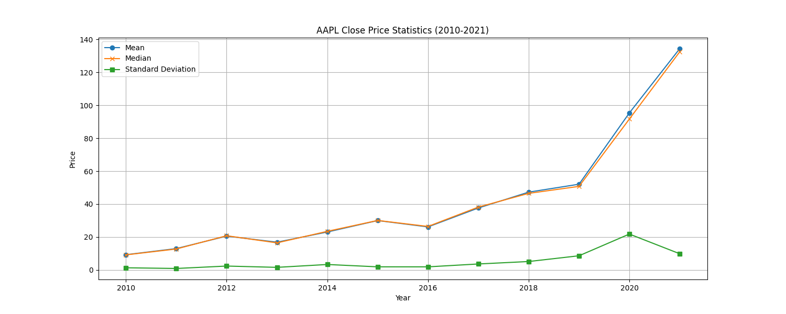

# IDS-706 Data Engineering: Project 8
This is a IDS-706 Week 8 project that tries to take an existing Python script (which interactes with SQL Database) for data processing and rewrite it in Rust.

This project provides a Rust-based solution for loading and analyzing Apple stock data from 2010 to 2021. The application reads data from a CSV file, stores it in a local SQLite database, and calculates annual statistics such as mean, median, and standard deviation for each year. This project demonstrates efficient data handling and analysis in Rust, using libraries like csv for parsing and rusqlite for database management.

## AAPL Price Statistics (2010-2021)

The data is from the everyday close price of <NASDAQ 100 Data From 2010> dataset on Kaggle.
>https://www.kaggle.com/datasets/kalilurrahman/nasdaq100-stock-price-data/data 

The statistics are as follows:
|   Year |      mean |    median |       std |
|-------:|----------:|----------:|----------:|
|   2010 |   9.28009 |   9.18089 |  1.3413   |
|   2011 |  13.0002  |  12.7509  |  0.925852 |
|   2012 |  20.5732  |  20.8032  |  2.39203  |
|   2013 |  16.8798  |  16.467   |  1.60314  |
|   2014 |  23.0662  |  23.475   |  3.34282  |
|   2015 |  30.01    |  30.075   |  1.92089  |
|   2016 |  26.151   |  26.4375  |  1.91019  |
|   2017 |  37.6378  |  38.185   |  3.6553   |
|   2018 |  47.2634  |  46.5125  |  5.14847  |
|   2019 |  52.064   |  50.7537  |  8.63474  |
|   2020 |  95.3471  |  91.6325  | 21.8098   |
|   2021 | 134.344   | 132.42    |  9.86899  |

## Description and Conclusion:
Apple Inc.'s stock performance from 2010 to 2021 shows significant growth, with the average
price rising from $9.28 to $134.34. The company saw consistent increases in stock value, 
particularly in 2020 and 2021, likely driven by strong demand for electronics during the pandemic
and its market leadership in innovation. While volatility increased in the later years, especially
in 2020 with the standard deviation peaking at 21.81, Apple's overall performance was robust,
reflecting its resilience and growth in the global tech industry.
