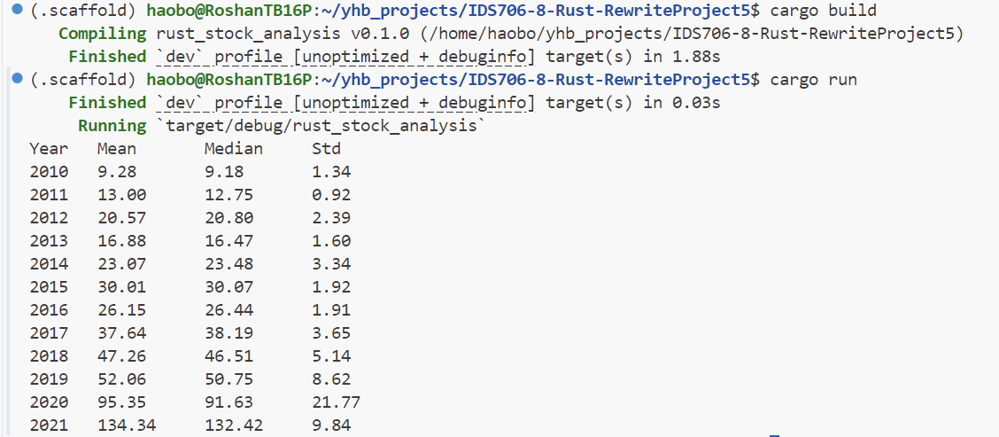

# IDS-706 Data Engineering: Project 8

This is the Week 8 project for IDS-706, focused on rewriting an existing Python data processing script in Rust.

In this project, I combine elements from my [Week 3 mini-project](https://github.com/haobo-yuan/IDS706-3-Polars-Stat), which utilized Polars to process stock data and calculate statistics, and my [Week 5 mini-project](https://github.com/haobo-yuan/IDS706-5-SQL-Python), which interfaced with an SQLite database for data storage and retrieval. The final outcome is a Rust-based solution for handling and analyzing Apple stock data from 2010 to 2021.

The application reads stock data from a CSV file, stores it in a local SQLite database, and calculates annual statistics, including mean, median, and standard deviation. This project highlights efficient data handling and analysis in Rust, leveraging libraries like `csv` for data parsing and `rusqlite` for database management.


## Run Result



## Highlight Improvements in Speed and Resource Usage

One of the key advantages of rewriting the data processing script in Rust is the significant improvement in speed and resource efficiency. Rust's compiled nature allows it to execute code much faster than Python, especially in data-intensive tasks. This efficiency is particularly valuable for large datasets, where Rust can reduce processing times and minimize memory overhead.

Compared to Python, which is an interpreted language, Rust's memory management model, along with zero-cost abstractions, helps achieve lower CPU and memory usage. By using Rust, this project demonstrates enhanced performance for data loading, analysis, and storage tasks, making it ideal for high-performance data engineering solutions.

## Project Details

### Data Processing


The statistical results are based on close price of <NASDAQ 100 Data From 2010> dataset on Kaggle.
>https://www.kaggle.com/datasets/kalilurrahman/nasdaq100-stock-price-data/data 

The csv file <stock_AAPL.csv> is generated by the same script from Week 3 mini-project [lib.py](https://github.com/haobo-yuan/IDS706-3-Polars-Stat/blob/main/lib.py), and using these codes to call it:

```python
# Load and preprocess data
stock_AAPL = preprocess_data()

# change column names to make after-processing easier
stock_AAPL.columns = ["date", "open", "high", "low", "close", "adj_close", "volume", "name", "year"]

# convert the polars DataFrame to a pandas DataFrame, and then export it to a CSV file
stock_AAPL.to_pandas().to_csv(os.path.join("data", "stock_AAPL.csv"), index=False)
```

These scripts are also stored in `/src` folder of this project.

### Instructions to Run the Project

1. Clone the repository to your local machine.
2. Navigate to the project directory.
3. Install Rust and Cargo if you haven't already.
4. Install the required dependencies
    ```bash
    sudo apt-get update
    sudo apt-get install libsqlite3-dev
    ```
5. Run the project using the following command:
    ```bash
    cargo build
    cargo run
    ```

### CI/CD Pipeline

These steps are used in `Makefile` and `main.yml` to set up the CI/CD pipeline for the project:

- Format code
- Lint code
- Test coce


## AAPL Price Statistics (2010-2021)

The final statistics are as follows:
| Year | Mean   | Median | Std  |
|------|--------|--------|------|
| 2010 | 9.28   | 9.18   | 1.34 |
| 2011 | 13.00  | 12.75  | 0.92 |
| 2012 | 20.57  | 20.80  | 2.39 |
| 2013 | 16.88  | 16.47  | 1.60 |
| 2014 | 23.07  | 23.48  | 3.34 |
| 2015 | 30.01  | 30.07  | 1.92 |
| 2016 | 26.15  | 26.44  | 1.91 |
| 2017 | 37.64  | 38.19  | 3.65 |
| 2018 | 47.26  | 46.51  | 5.14 |
| 2019 | 52.06  | 50.75  | 8.62 |
| 2020 | 95.35  | 91.63  | 21.77 |
| 2021 | 134.34 | 132.42 | 9.84 |

A plot of the mean close price for each year generated from previous project is shown below:


## Description and Conclusion:
Apple Inc.'s stock performance from 2010 to 2021 shows significant growth, with the average
price rising from $9.28 to $134.34. The company saw consistent increases in stock value, 
particularly in 2020 and 2021, likely driven by strong demand for electronics during the pandemic
and its market leadership in innovation. While volatility increased in the later years, especially
in 2020 with the standard deviation peaking at 21.81, Apple's overall performance was robust,
reflecting its resilience and growth in the global tech industry.
